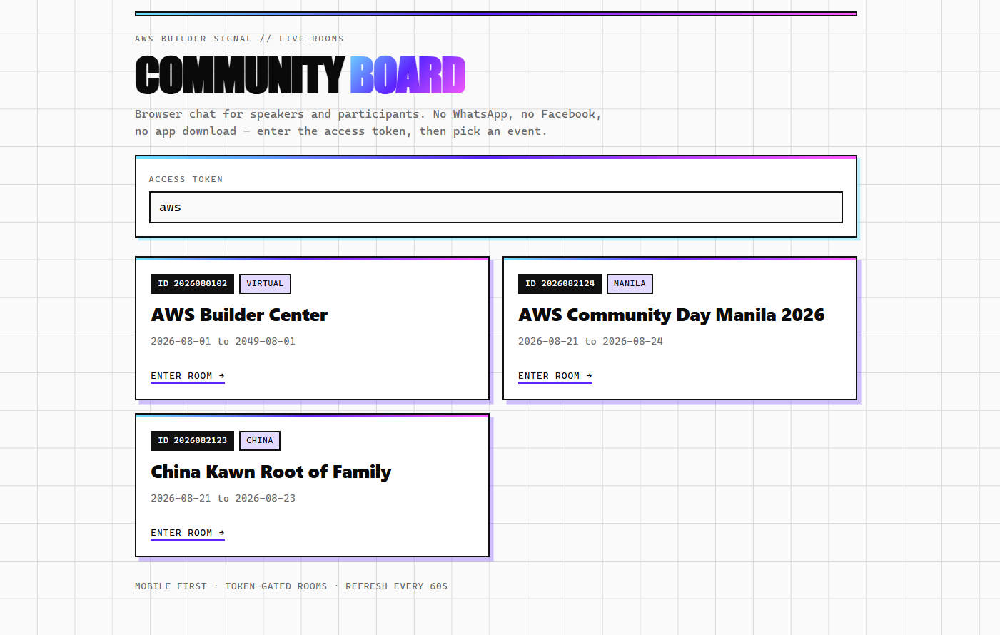
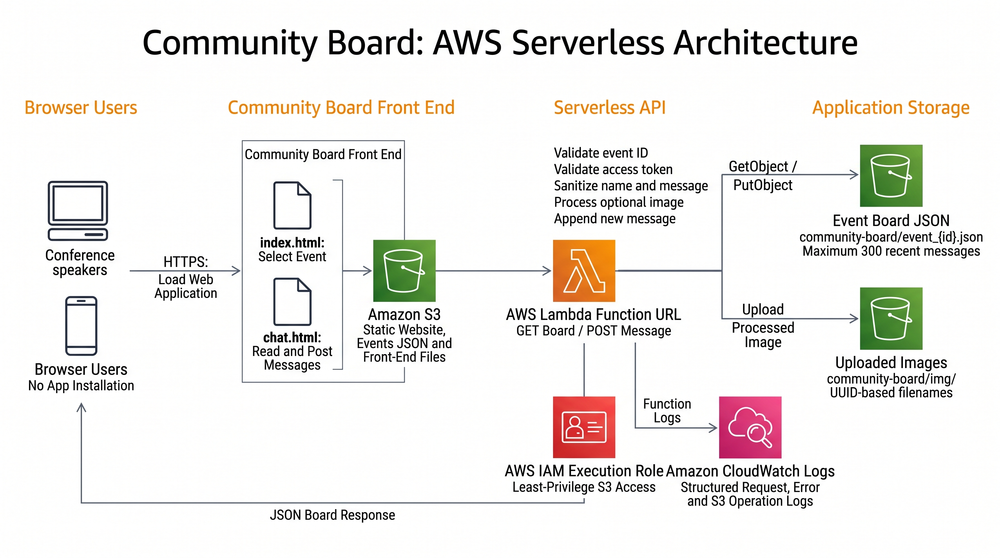
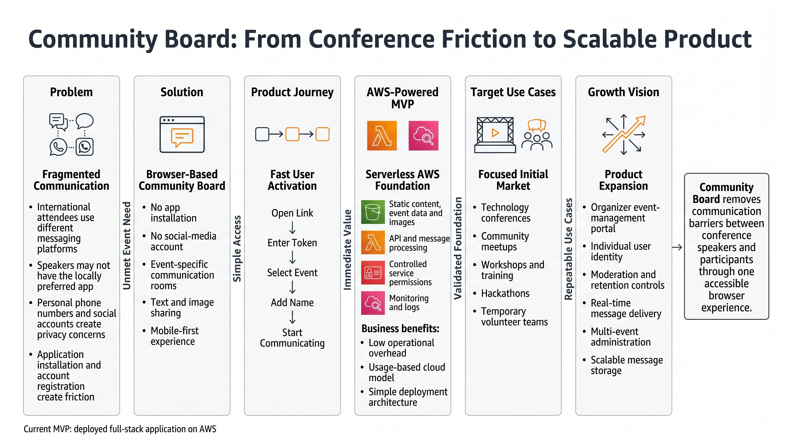
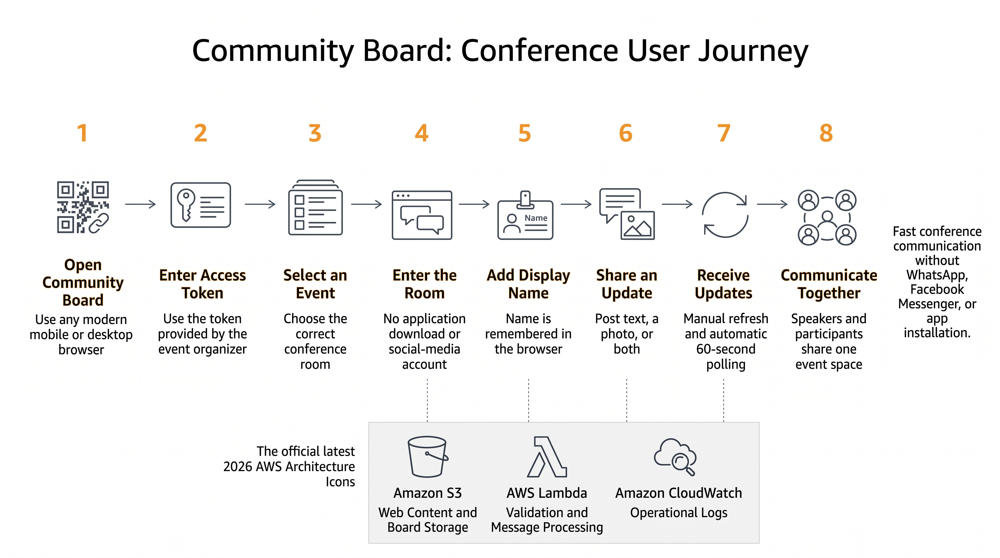

# Full Stack Challenge: AWS Community Day Board App

AWS Community Day attendees often use different messaging platforms, while international speakers may not want another app, account, or request for personal contact details. Community Board provides a simple browser-based event room for sharing updates, locations, meeting details, and images. Powered by AWS Lambda and Amazon S3, the mobile-first MVP is practical and inexpensive for short-term event communication.






---

**Try the application:** [Community Board](https://aws-user-group.com/community-board/index.html)
**Github:** [Repo link](https://github.com/dchan-dev/aws-community-board)

---

Conference communication should be easy. Too often, it is not.

A conference may bring together local participants, international speakers, sponsors, volunteers, and organizers for only one or two days. These people need to exchange practical information quickly: where a session is being held, whether a speaker needs an adapter, when a room has changed, where to meet after a talk, or how to share a photo from the event. Yet the usual communication options create friction. Some attendees use WhatsApp, some use Facebook Messenger, and others do not have either service. International experts may not want to install another application, create another account, or expose a personal phone number just to communicate during one conference.

I built **Community Board** to remove that barrier. It is a lightweight, browser-based communication application for conference speakers and participants. A user opens a web page, enters the event access token, picks the correct event room, adds a display name, and starts sharing text or images. There is no mobile app to download and no social-media account to exchange.

The project deliberately uses a small full-stack architecture on AWS. A mobile-first front end runs in the browser, an AWS Lambda function provides the application logic, and Amazon S3 stores the event data and uploaded images. The result is an MVP that is easy to explain, inexpensive to operate at small-event scale, and practical to improve after testing it with real conference users.

---

## Vision and What It Does

The vision for Community Board is simple: **give everyone at a conference a shared communication space that works from a normal web browser**.

This idea came from a real interoperability problem. Conference participants do not all belong to the same messaging ecosystem. Asking everyone to use one consumer chat platform sounds easy, but it creates several problems:

1. **Not everyone has the same app.** An international speaker may not use the messaging platform that is common in the host country.
2. **Installing an app takes time.** Conference communication is temporary and urgent. Downloading an app, creating an account, verifying a phone number, and reviewing permissions is too much friction.
3. **Personal contact details may be exposed.** People may not want to share a personal phone number or social-media identity with a temporary group.
4. **The context is fragmented.** Messages can be divided across private chats, group chats, email threads, and social platforms.
5. **Event information has a short useful life.** A simple room for a specific event may be more appropriate than a permanent community account.

Community Board addresses these issues with event-specific rooms and a token-gated entry flow. The landing page retrieves the list of events and presents each one as a clear card. A participant enters the access token supplied by the organizer and selects the relevant event. The browser then opens that event's chatroom and carries the event ID and token in the request.

Inside the chatroom, participants can:

- choose a display name;
- post a text message;
- attach an image;
- see the sender and local display time for each post;
- manually refresh the room;
- receive an automatic update every 60 seconds;
- open an image in a lightbox;
- zoom and move an enlarged image with mouse, pointer, or touch controls; and
- return to the event list without navigating through an installed application.

The interface also remembers the user's display name in browser local storage. This is a small UX detail, but it matters during a busy event because the participant does not need to type the same name whenever the page is revisited.

The primary users are conference speakers and attendees, but the same pattern could support workshops, community meetups, hackathons, temporary training rooms, volunteer teams, or user-group events. The application is intentionally not positioned as a replacement for a large enterprise collaboration platform. Its strength is focused, temporary, low-friction communication.

---

## Full-Stack Breakdown: From Pitch to Launch

I approached the project by connecting each stage to the product journey discussed across the Code.TV series: pitch, prototype, MVP, UX, and launch. That structure helped me avoid beginning with technology for technology's sake. Instead, each implementation choice had to support a user need.

### 1. Pitch: One Browser, One Room, No App Install

The pitch was based on a single sentence:

> Community Board lets conference speakers and participants communicate in an event-specific browser room without installing an app or exchanging personal social-media accounts.

A useful pitch needs a specific user, a recognizable problem, and a clear outcome. “Build a chat app” would have been too broad. By narrowing the scenario to conferences, I could make better decisions about identity, access, refresh speed, data retention, and interface design.

The conference setting also gave me a practical test for every feature. Does it help a speaker or participant communicate during an event? If not, it probably does not belong in the first release.

### 2. Prototype: Prove the Journey Before Building the Backend

The next step was to prototype the simplest user journey:

1. Open the Community Board landing page.
2. Enter an event access token.
3. Select an event.
4. Enter a display name.
5. Read and post messages.
6. Optionally attach an image.

I built the interface with plain HTML, CSS, and JavaScript. This kept the prototype direct and made the browser behavior easy to inspect. The landing page and chatroom are separate files, which creates a clear boundary between event discovery and room participation.

The landing page fetches an `events.json` document from the hosted site and falls back to a local relative file if the primary request fails. It validates that an access token has been entered before opening a room. It also escapes event values before inserting them into generated markup, which reduces the risk of treating event data as executable HTML.

The chat prototype established the main interaction patterns: a fixed header, a scrollable feed, and a composer at the bottom of the screen. I used a mobile-first layout because many conference users will open the board by scanning a link or typing a URL on a phone.

### 3. MVP: Complete the Smallest Useful Full Stack

For the MVP, I needed more than a visual prototype. Messages had to move from the user's browser to an AWS backend, survive a page refresh, and become visible to other participants.

The browser calls an AWS Lambda Function URL. A `GET` request loads the board for one event, while a `POST` request submits a display name, text, and an optional image. The Lambda function validates the event and its token, reads the current board JSON from Amazon S3, adds the new message, and writes the updated JSON object back to S3.

Images follow a related path. Before upload, the browser uses a canvas to resize the image so its longest edge is no more than 2,000 pixels and converts the result to JPEG at a defined quality level. The image is then sent as a data URL in the request. Lambda validates the supported image format and request size, decodes the image, gives it an event-specific UUID filename, and stores it under the board's image prefix in S3. The message record stores the resulting public image path rather than embedding the full image payload in the event JSON.

This was enough to make the application genuinely useful. It supported multiple event rooms, text, images, persistence, refresh, validation, and a deployable browser experience.

### 4. UX: Reduce Friction in a Busy Conference Environment

Conference software is often used while someone is walking, preparing to speak, or switching between sessions. The interface therefore needed to be readable and forgiving rather than feature-heavy.

I used large tap targets, high-contrast borders, clear focus indicators, responsive sizing, and safe-area spacing for mobile devices. Status text tells users whether the board is locked, refreshing, synchronized, sending, or unable to load. The composer supports Enter to send and Shift+Enter for a new line, while still providing a visible Send button for touch users.

Image handling received extra attention. A user sees a preview before sending and can remove the selected image. Posted images can be opened in a full-screen lightbox. The viewer supports zoom buttons, the mouse wheel, pointer dragging, and a two-finger pinch gesture. These capabilities are useful when users share a room map, slide photo, timetable, or equipment image.

I also avoided unnecessary account creation. The event token provides lightweight room gating, while the display name creates enough identity for an informal conference board. This is an intentional MVP trade-off, not a complete authentication system.

### 5. Launch: Deploy, Observe, and Create a Feedback Loop

The launch stage turned the project into a public web application rather than a local demonstration. The static front end and board assets are hosted through the AWS-backed website, while the server-side behavior is exposed through a Lambda Function URL.

I added structured log messages around input, output, S3 reads, S3 writes, image uploads, validation failures, and message counts. Those logs make troubleshooting much easier than scattered string messages. For example, I can distinguish an unknown event, invalid token, malformed JSON body, failed S3 read, and failed image write.

The application refreshes after a successful post and also polls every 60 seconds. Polling is not as immediate as a WebSocket connection, but it is easy to operate and adequate for this first version. The manual Refresh button helps when a participant expects an urgent update.

Launching an MVP does not mean the application is finished. It means the complete product loop is now available: users can try the app, I can observe where they struggle, and the next version can be based on evidence rather than assumptions.

---

## How I Built It

### Front-End Structure

The front end consists of two main pages.

`index.html` is the event selection page. It displays the Community Board introduction, asks for an access token, loads the event list, and creates one card for each available event. When the user chooses a card, the page adds both the event ID and token to the chatroom URL.

`chat.html` is the communication experience. It reads the event ID and token from the query string, loads the corresponding board, renders messages, and enables the composer. The display name is saved to local storage. Text is escaped before rendering, and image URLs are only accepted if they match the expected application domain and filename pattern.

I chose framework-free JavaScript because the application has a small number of screens and a straightforward state model. That reduced build tooling and made deployment as static files simple. It also forced me to think carefully about browser APIs, DOM updates, validation, and asynchronous requests.

### Backend Structure

The backend is a Node.js 20.x Lambda function using the AWS SDK for JavaScript. It accepts `GET`, `POST`, and `OPTIONS` requests through a Lambda Function URL.

For `GET`, the function:

1. reads the event ID and token;
2. checks whether the event is known;
3. compares the supplied token with the expected value using a timing-safe comparison;
4. reads `community-board/event_{id}.json` from S3;
5. creates an empty in-memory board if the object does not exist; and
6. returns a sanitized board response.

For `POST`, the function:

1. parses the JSON request body;
2. validates the event and token;
3. cleans and limits the display name and message text;
4. verifies that either text or an image is present;
5. validates and decodes an optional image;
6. writes the image to S3 with a UUID-based filename;
7. reads the existing board;
8. appends the new message;
9. retains the most recent 300 messages;
10. writes the updated board JSON to S3; and
11. returns the created message and update timestamp.

I limited names to 40 characters and messages to 2,000 characters. The Lambda function also places a maximum size on an encoded image request. These controls protect the application from accidentally oversized input and keep the board appropriate for quick event communication.

### Key Decisions

One important decision was to store each event board as a JSON object in S3 instead of introducing a database in the first release. This made the architecture small and the stored state easy to inspect. For a controlled event with moderate message volume, it is a practical way to validate the product idea.

Another decision was to use scheduled polling rather than real-time sockets. A 60-second interval reduces implementation and operational complexity. Users can also refresh manually, and the page reloads the board immediately after a successful post. This delivers a “near-live community board” experience without pretending the MVP is a high-throughput real-time messaging service.

Finally, I kept access control intentionally lightweight. Each recognized event has a matching token, and the backend validates every read and write. The token is a shared event secret, not individual authentication. That is sufficient for an MVP and a limited event audience, but production growth would require a more robust identity and authorization design.

---

## Challenges and How I Overcame Them

### Challenge 1: Supporting Images Without a Complex Upload Workflow

Allowing images can quickly complicate a simple application. Large phone photos increase request size, take longer to upload, and should not be stored directly inside the board JSON.

I addressed this in two stages. First, the browser resizes the image before sending it. Second, Lambda separates the binary image from the message record. The function writes image bytes to an S3 image prefix, then stores only a generated filename and public path with the chat message. This keeps event JSON smaller and lets the browser load an image as a normal web asset.

### Challenge 2: Keeping User-Provided Content Safe to Render

A communication board displays values that come from users and event configuration. Inserting those values directly into HTML would be unsafe.

The front end escapes text, names, event labels, and other dynamic strings before rendering them. Image sources are restricted to the application's expected domain and filename structure. The backend also removes control characters and enforces length limits. This is not a substitute for a full security review, but it is a strong baseline for the MVP.

### Challenge 3: Making the Experience Work on Phones

A desktop-only chat would miss the real conference use case. Mobile browsers also introduce details such as viewport sizing, safe-area insets, virtual keyboards, touch gestures, and small tap targets.

I designed the layout around `100dvh`, safe-area environment values, responsive widths, and controls large enough to tap. The feed scrolls independently between the header and composer. The image viewer provides both button controls and touch gestures. Inputs use a 16-pixel font size, which also helps avoid unwanted zoom behavior on some mobile browsers.

### Challenge 4: Diagnosing Distributed Failures

A failed message could originate in the browser, Function URL request, token validation, image parsing, S3 read, or S3 write. Without useful logs, every failure can look the same.

The Lambda code writes structured JSON logs with a timestamp, label, and relevant metadata. It records the start and result of S3 operations and summarizes requests without printing the token value. This gives me a traceable path through the backend while avoiding direct token logging in the input summary.

### Challenge 5: Balancing Simplicity With Correctness

The biggest design challenge was knowing where simplicity becomes a limitation. S3 JSON storage is easy to understand, but concurrent writes could overwrite one another if many users post at exactly the same time. A shared token is convenient, but it is not user-level identity. Polling is simple, but it is not instant.

I treated these points as explicit MVP constraints rather than hiding them. The current version proves the product journey. A larger production version could move messages to Amazon DynamoDB, add Amazon Cognito for identity, use AWS AppSync or API Gateway WebSocket APIs for real-time updates, put Amazon CloudFront in front of static assets, and introduce moderation and retention controls. The important lesson is to evolve architecture in response to demonstrated demand.

---

## AWS Services and Architecture

The deployed application uses the following core AWS capabilities:

- **Amazon S3:** hosts the website content and stores event JSON documents and uploaded images.
- **AWS Lambda:** runs the Node.js backend that validates access, reads boards, creates messages, processes images, and updates board state.
- **AWS Lambda Function URL:** exposes HTTPS endpoints used directly by the browser for `GET` and `POST` requests, with CORS configured at the Function URL.
- **AWS Identity and Access Management (IAM):** grants the Lambda execution role only the required S3 read and write actions for event JSON and image object paths.
- **Amazon CloudWatch Logs:** receives the Lambda function's structured console logs for operational troubleshooting and observation.

### Request Flow

```text
Conference participant
        |
        | HTTPS: load static pages and event list
        v
Amazon S3 hosted web content
        |
        | Browser opens chat.html with event ID and token
        v
JavaScript client in the browser
        |
        | GET board / POST message via HTTPS
        v
AWS Lambda Function URL
        |
        v
AWS Lambda (Node.js validation and application logic)
        |
        +-------- GetObject / PutObject --------+
        |                                        |
        v                                        v
S3 event JSON objects                    S3 uploaded images
community-board/event_{id}.json          community-board/img/...
```

When a user reads a room, the browser sends the event ID and token to the Function URL. Lambda validates the pair and returns the corresponding board from S3. When the user posts, Lambda validates and cleans the input, optionally stores an image, appends a message, and writes the updated board. The browser then loads the newest state and renders it.

The Lambda IAM permissions are scoped to the relevant event JSON and image prefixes. The function uses environment variables for the bucket name, key prefix, and public image base. This makes the code easier to move between environments without changing every storage path.

---

## What I Learned

The most important lesson was that full-stack development is not simply “front end plus backend.” It is the design of a complete path from a human need to a reliable interaction.

I learned to begin with friction. The key problem was not a missing chat technology. Many excellent messaging tools already exist. The problem was that conference visitors may not share an app, account, or communication norm. Once I framed the project around that barrier, a browser application became the natural solution.

I also learned that a prototype and an MVP answer different questions. The prototype asked whether the user journey was understandable. The MVP asked whether the whole system could accept, store, retrieve, and display real messages and images after deployment. Connecting the browser, Lambda, IAM, and S3 made the application real.

Working with serverless AWS services reinforced the value of small operational boundaries. Lambda contains the request logic. S3 contains durable objects. IAM defines what the function may access. The Function URL gives the browser a direct HTTPS entry point. Each part is understandable by itself, but the application only succeeds when their permissions, request formats, CORS behavior, object keys, and response shapes agree.

The image feature taught me to think across the whole stack. Resizing in the browser improves the upload before it reaches AWS. Lambda validates the type and size rather than trusting the client. S3 stores the binary asset separately. The event JSON stores only the reference. The front end validates the returned image path and provides an accessible viewing interaction. One visible feature required coordinated decisions in UX, networking, security, compute, and storage.

I learned the importance of designing failure messages. “Something went wrong” is not enough when testing a distributed application. The UI distinguishes missing tokens, missing names, empty messages, refresh failures, upload problems, and backend errors. The Lambda function distinguishes unknown events, invalid tokens, malformed input, unsupported methods, and storage failures. Structured logs then help connect user-visible behavior to backend activity.

Finally, I learned to treat limitations as part of responsible engineering. The current Community Board is appropriate for a small, controlled conference use case, but I would not claim that one mutable JSON object is the right storage pattern for unlimited concurrent chat. I now have a clearer migration path because the MVP exposed the boundaries: stronger authentication, atomic message writes, event administration, moderation, retention policies, rate limiting, and real-time delivery can be added as real usage justifies them.

---

## What Comes Next

My next steps would focus on production readiness and organizer experience:

1. move messages to Amazon DynamoDB for independent, concurrency-safe records;
2. add time-to-live policies so temporary event messages expire automatically;
3. use Amazon Cognito if events require individual identities;
4. add rate limiting, abuse controls, and moderation tools;
5. protect sensitive configuration through managed secrets rather than source code;
6. add an organizer page for creating events and rotating access tokens;
7. improve accessibility testing with keyboard-only and screen-reader journeys;
8. add automated front-end and Lambda tests;
9. add infrastructure as code for repeatable deployment; and
10. evaluate real-time delivery if users need updates faster than polling.

The project does not need all of those features to demonstrate its value today. Community Board already shows how a focused idea can become a complete deployed application by moving through pitch, prototype, MVP, UX, and launch.

---

## Conclusion

Community Board solves a practical conference problem with a deliberately simple AWS full stack. Speakers and participants can communicate through a browser without installing an app, joining a social network, or exchanging personal contact details. Event rooms organize the conversation, shared tokens provide lightweight gating, and text and image posts cover common event needs.

Building the project helped me connect product thinking with cloud engineering. The pitch defined the audience and friction. The prototype clarified the journey. The MVP connected the browser to persistent AWS services. UX work made the result practical on mobile devices. Launch and logging created the foundation for real feedback.

Most importantly, the project reminded me that successful full-stack applications do not have to begin with a large architecture. They begin with a specific person, a specific obstacle, and the smallest complete experience that removes it.

**Application:** [https://aws-user-group.com/community-board/index.html](https://aws-user-group.com/community-board/index.html)

**Public repository:** Replace this line with your public GitHub repository URL before submitting if the application link is not used as the qualifying link.
